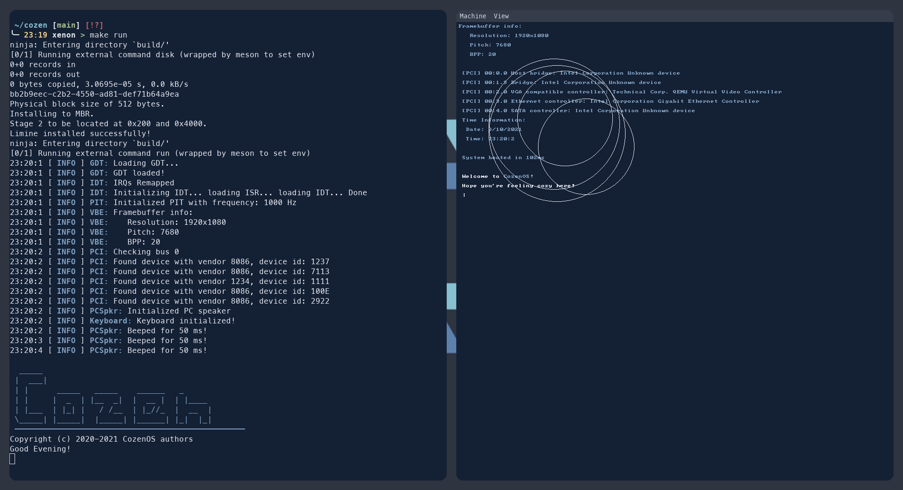

 A kernel written for fun in C 

Features of the OS:
- VBE driver
- Keyboard driver
- PIT
- ACPI tables
- PCI enumeration
- PC speaker driver

### Screenshots

##### Contributors to this project are listed in assets/contrib

###### This is a fork of emerald by Abb1x (license file in assets/)

